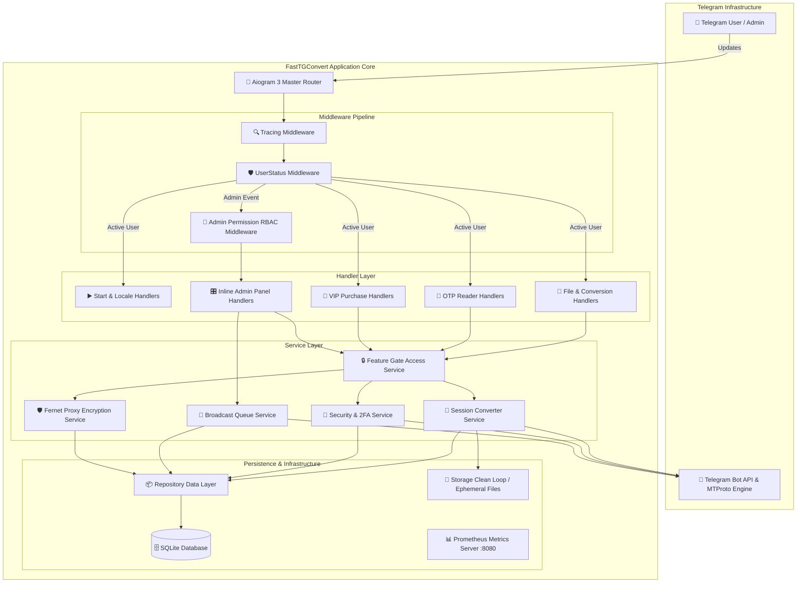
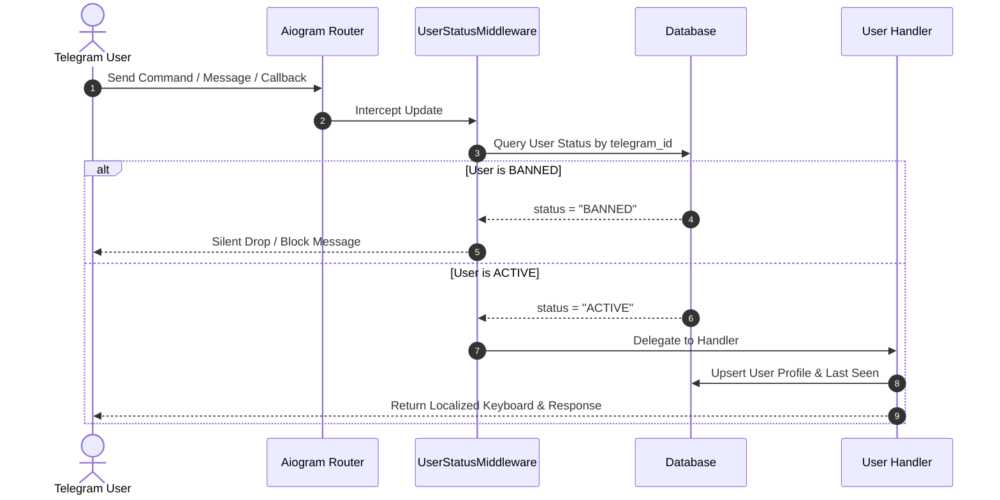
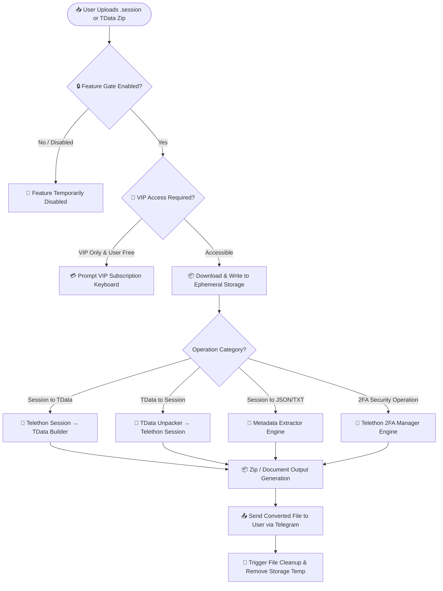
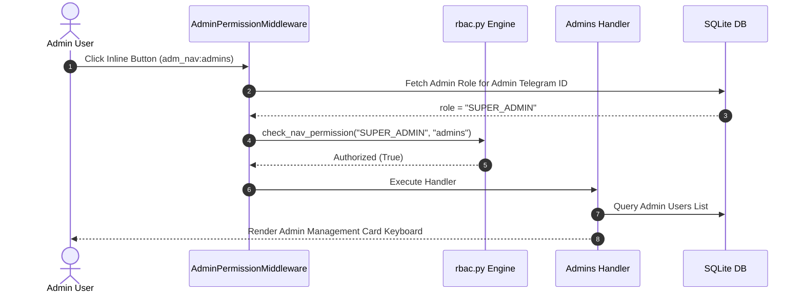
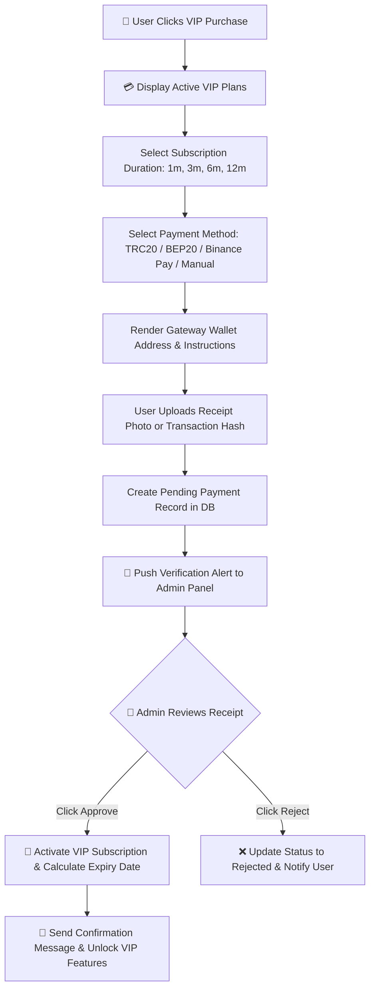
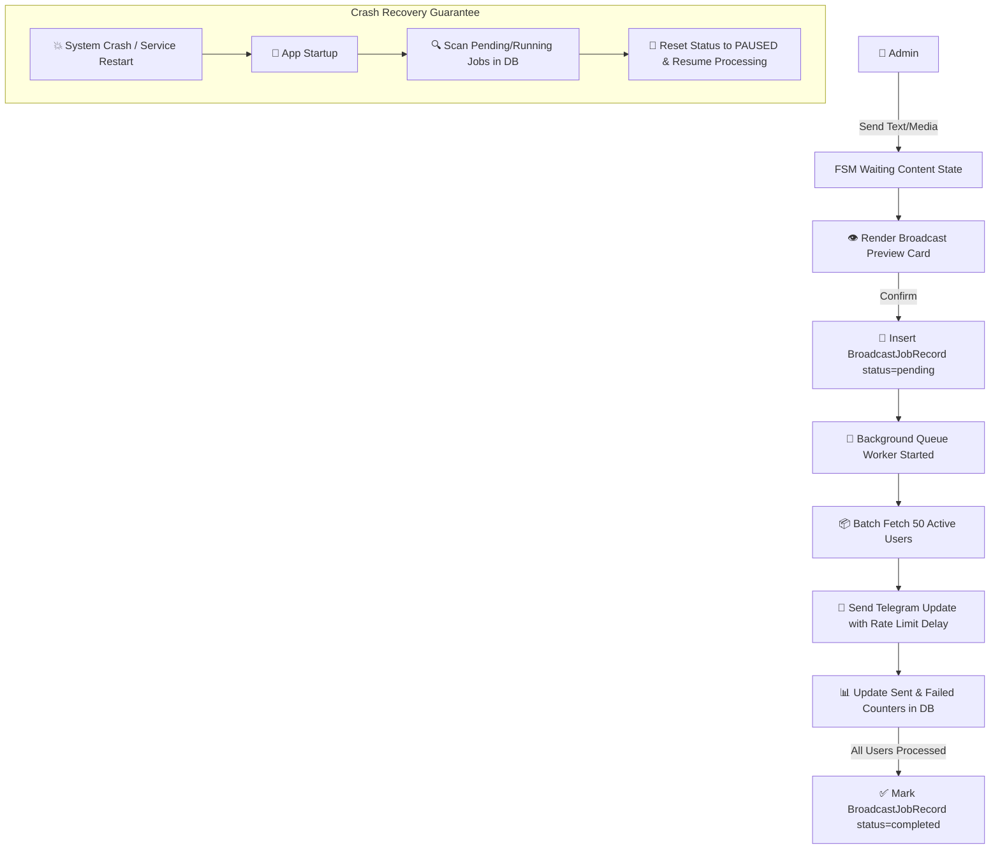
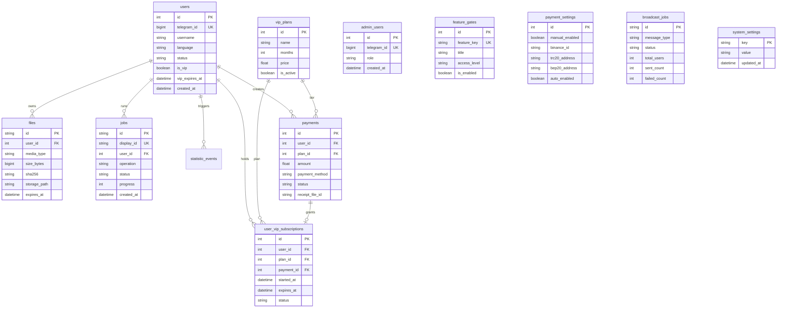
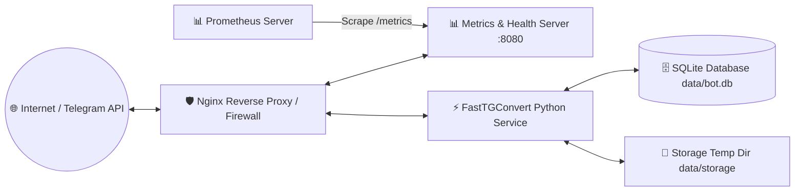

<div align="center">

# ⚡ FastTGConvert Enterprise
### Production-Grade Telegram Session Management & File Conversion Suite

[](https://www.python.org/)
[](https://docs.aiogram.dev/)
[](https://www.sqlalchemy.org/)
[](https://prometheus.io/)
[](tests/)
[](docs/README_EN.md#5-security-architecture)

<p align="center">
  <b>FastTGConvert</b> is an enterprise-level, asynchronous microservice platform engineered for Telegram session lifecycle management, file format conversion, security auditing, and account utilities. Built with clean layered architecture, non-blocking I/O, fine-grained Role-Based Access Control (RBAC), and full Prometheus/Grafana observability.
</p>

[📚 Read Full Documentation](docs/README_EN.md) • [🌐 Supported Languages](#-supported-languages) • [🚀 Quick Deployment](#-deployment-architecture--guide) • [🧪 Test Report](#-testing--qa-matrix)

---

</div>

## 📑 Table of Contents

- [1. Executive Summary & Value Proposition](#1-executive-summary--value-proposition)
- [2. Feature Comparison Matrix](#2-feature-comparison-matrix)
- [3. System Architecture](#3-system-architecture)
  - [3.1 High-Level Microservice Architecture](#31-high-level-microservice-architecture)
  - [3.2 Component & Layer Topology](#32-component--layer-topology)
- [4. User & Operation Flows](#4-user--operation-flows)
  - [4.1 User Onboarding & Middleware Pipeline](#41-user-onboarding--middleware-pipeline)
  - [4.2 Session & File Conversion Engine Flow](#42-session--file-conversion-engine-flow)
- [5. Admin Panel Suite & RBAC Flow](#5-admin-panel-suite--rbac-flow)
  - [5.1 Navigation Hierarchy & Module Map](#51-navigation-hierarchy--module-map)
  - [5.2 Role-Based Access Control (RBAC) Matrix](#52-role-based-access-control-rbac-matrix)
  - [5.3 Admin Action Workflow](#53-admin-action-workflow)
- [6. VIP Journey & Payment Lifecycle](#6-vip-journey--payment-lifecycle)
  - [6.1 Customer VIP Acquisition Journey](#61-customer-vip-acquisition-journey)
  - [6.2 Multi-Gateway Payment Verification Engine](#62-multi-gateway-payment-verification-engine)
- [7. Broadcast Engine Architecture](#7-broadcast-engine-architecture)
  - [7.1 Queue Dispatch & Fault Recovery Flow](#71-queue-dispatch--fault-recovery-flow)
- [8. Database ER Diagram & Schema Reference](#8-database-er-diagram--schema-reference)
- [9. Security Architecture & Threat Model](#9-security-architecture--threat-model)
- [10. Deployment Architecture & Operational Guide](#10-deployment-architecture--operational-guide)
- [11. Observability & Telemetry Specification](#11-observability--telemetry-specification)
- [12. Developer Architecture Guide](#12-developer-architecture-guide)
- [13. Testing & QA Matrix](#13-testing--qa-matrix)
- [14. Release Changelog](#14-release-changelog)

---

## 🌐 Supported Languages

FastTGConvert natively supports **6 production locales** across user interfaces and localized administrative responses:

| Code | Flag | Language Name | Localized Documentation |
|---|---|---|---|
| `en` | 🇬🇧 | English | **[English Documentation](docs/README_EN.md)** |
| `bn` | 🇧🇩 | বাংলা (Bengali) | **[বাংলা নথি](docs/README_BN.md)** |
| `hi` | 🇮🇳 | हिन्दी (Hindi) | **[हिन्दी दस्तावेज़](docs/README_HI.md)** |
| `ur` | 🇵🇰 | اردو (Urdu) | **[اردو دستاویزات](docs/README_UR.md)** |
| `ar` | 🇸🇦 | العربية (Arabic) | **[الوثائق بالعربية](docs/README_AR.md)** |
| `zh` | 🇨🇳 | 中文 (Chinese) | **[中文文档](docs/README_ZH.md)** |

---

## 1. Executive Summary & Value Proposition

FastTGConvert solves the operational overhead associated with managing Telegram session files at scale. Designed for community managers, automation developers, and security auditors, it provides a centralized web-scale bot backend to perform fast, non-blocking session operations.

> [!IMPORTANT]
> **Enterprise Architecture Standards**:
> - **100% Async Execution**: Powered by `asyncio` and `Telethon` worker pools.
> - **Zero Data Persistence Risks**: Auto-purges temporary session files via retention loops.
> - **Fault-Tolerant Broadcasts**: Interrupt recovery preserves campaign progress across app restarts.
> - **Dynamic Feature Toggling**: Shift any bot feature between `FREE` and `VIP_ONLY` without code deployment.

---

## 2. Feature Comparison Matrix

| Feature / Capability | Standard Scripts | Legacy Telegram Bots | FastTGConvert Enterprise |
|---|:---:|:---:|:---:|
| **Bidirectional `.session` ↔ `TData` Conversion** | ❌ Manual | ⚠️ Limited | ✅ Full Automatic Support |
| **Session Security Audit (2FA Change/Reset)** | ❌ No | ❌ No | ✅ Full Automated Utility |
| **Role-Based Admin Access (RBAC)** | ❌ Single Admin | ⚠️ Hardcoded IDs | ✅ 4-Tier RBAC (Owner, Super Admin, Admin, Support) |
| **Dynamic Feature Gate Control** | ❌ No | ❌ No | ✅ Real-time DB Toggle (`FREE` / `VIP_ONLY`) |
| **Cryptographic Proxy Password Storage** | ❌ Plaintext | ❌ Plaintext | ✅ Fernet AES-128 Base64 Encryption |
| **Prometheus Metrics Exporter** | ❌ No | ❌ No | ✅ Native Endpoint (`/metrics`, `/healthz`, `/readyz`) |
| **Broadcast Crash Recovery** | ❌ No | ❌ Job Loss | ✅ Persistent Queue with Resume Capabilities |
| **Unit & Integration Test Suite** | ❌ 0% | ❌ 0% | ✅ 296 Automated Pytest Suite (100% Pass) |

---

## 3. System Architecture

### 3.1 High-Level Microservice Architecture

The following diagram illustrates the update pipeline from incoming Telegram events down to database storage and external Telegram API calls:



### 3.2 Component & Layer Topology

- **Transport Layer (`app/handlers/`)**: Receives Telegram callbacks, commands, and document uploads. Formats responses with localized HTML templates.
- **Security & Authorization Layer (`app/middlewares/`, `app/admin/rbac.py`)**: Intercepts events to validate user status (BANNED check) and enforce section-level admin permissions.
- **Business Service Layer (`app/services/`)**: Encapsulates core domain algorithms (TData unpacking, Telethon client initialization, proxy encryption, 2FA management).
- **Data Access Layer (`app/db/repositories.py`)**: Implements clean Repository pattern for DB operations using SQLAlchemy 2.0 sessions.

---

## 4. User & Operation Flows

### 4.1 User Onboarding & Middleware Pipeline



### 4.2 Session & File Conversion Engine Flow



---

## 5. Admin Panel Suite & RBAC Flow

### 5.1 Navigation Hierarchy & Module Map

The Admin Panel operates on a 100% Inline-Keyboard flow. Legacy slash commands (`/add_admin`, `/remove_admin`) have been completely replaced with dynamic callback keyboards.

```
🎛️ Admin Panel Main Menu
 ├── 📊 Statistics (Today, Week, Month, Revenue, Task Counts)
 ├── 👥 User Management (Paginated List, User Search, User Card, VIP Grant, Ban/Unban, Direct Msg)
 ├── 📢 Broadcast Engine (Custom Broadcast, Forward Broadcast, Queue Monitor, Pause/Resume)
 ├── 👮 Admin Management (Role List, Add Admin FSM, Role Change, Remove Admin)
 ├── 📌 Force Join Channels (Public/Private Channels, Toggle Active, Add/Remove Channel)
 ├── 🎧 Support Settings (Dynamic Support Contact Username Setup)
 └── 💎 VIP System Management (Plan Builder, Payment Gateway Config, Payment Receipts Approval)
```

### 5.2 Role-Based Access Control (RBAC) Matrix

FastTGConvert enforces a 4-tier hierarchical access system:

| Role Name | Authority Level | Accessible Admin Sections | Restricted Actions |
|---|:---:|---|---|
| **`OWNER`** | `100` | All Sections (Unrestricted) | None |
| **`SUPER_ADMIN`** | `30` | Statistics, Users, Broadcast, Support, VIP, **Admin Mgmt**, **Force Join** | Modifying Owner Role |
| **`ADMIN`** | `20` | Statistics, Users, Broadcast, Support, VIP | Admin Mgmt, Force Join |
| **`SUPPORT`** | `10` | Statistics, Users View, Direct Message | Ban Users, VIP Grant, Broadcast, Admin Mgmt, Force Join |

### 5.3 Admin Action Workflow



---

## 6. VIP Journey & Payment Lifecycle

### 6.1 Customer VIP Acquisition Journey



### 6.2 Multi-Gateway Payment Verification Engine

- **Manual Gateway**: Admin accepts custom proof (e.g. wire transfer).
- **Crypto Gateways**: Supports **USDT TRC20**, **USDT BEP20**, and **Binance Pay ID**. Addresses are dynamically managed via the Admin Panel and stored in `payment_settings`.

---

## 7. Broadcast Engine Architecture

### 7.1 Queue Dispatch & Fault Recovery Flow



---

## 8. Database ER Diagram & Schema Reference



---

## 9. Security Architecture & Threat Model

### Security Layer Highlights
1. **Fernet Proxy Encryption**: Proxy passwords entered by users are encrypted at rest using AES-128 in CBC mode with HMAC authentication (`PROXY_ENCRYPTION_KEY`). Plaintext credentials are never written to disk or logs.
2. **Session Memory Isolation**: Telethon instances operate in temporary memory buffers or ephemeral files (`STORAGE_DIR`).
3. **HTML Sanitization**: All user-generated text inputs in the Admin Panel are passed through `html.escape` to prevent Telegram HTML injection attacks.
4. **Banned User Protection**: `UserStatusMiddleware` drops all updates from users marked `BANNED` at the very top of the Aiogram dispatcher chain.

---

## 10. Deployment Architecture & Operational Guide

### Production Infrastructure Architecture



### Systemd Linux Service Configuration

Create `/etc/systemd/system/fasttgconvert.service`:

```ini
[Unit]
Description=FastTGConvert Enterprise Telegram Bot
After=network.target sqlite3.service

[Service]
Type=simple
User=ubunti
WorkingDirectory=/home/ubunti/Desktop/my-projects/@FastTGConvert_bot/FastTGConvert_bot
ExecStart=/home/ubunti/Desktop/my-projects/@FastTGConvert_bot/FastTGConvert_bot/.venv/bin/python3 -m app
Restart=always
RestartSec=5
Environment=PYTHONUNBUFFERED=1

[Install]
WantedBy=multi-user.target
```

```bash
# Reload systemd and start service
sudo systemctl daemon-reload
sudo systemctl enable fasttgconvert
sudo systemctl start fasttgconvert

# Check real-time logs
journalctl -u fasttgconvert -f
```

---

## 11. Observability & Telemetry Specification

FastTGConvert features a built-in asyncio HTTP server (`app/core/metrics_server.py`) running on port `8080`:

| Endpoint | HTTP Method | Auth Required | Purpose | Response |
|---|:---:|:---:|---|---|
| `/healthz` | GET | No | Liveness Probe | `{"status": "ok"}` |
| `/readyz` | GET | No | Readiness Probe (DB Check) | `{"status": "ready", "database": "connected"}` |
| `/metrics` | GET | Optional Bearer | Prometheus Metrics Exporter | Prometheus exposition format |

---

## 12. Developer Architecture Guide

### Project Directory Layout

```
FastTGConvert_bot/
 ├── app/
 │    ├── admin/               # Admin Panel UI, Callbacks, Handlers, RBAC
 │    ├── core/                # Logging, Tracing, Metrics, Retry Service
 │    ├── db/                  # Database Models, Session Factory, Repositories, Migrations
 │    ├── handlers/            # End-User Handlers (Files, OTP, Start, VIP)
 │    ├── middlewares/         # Global Middlewares (UserStatus, Tracing)
 │    ├── services/            # Core Domain Services (Telethon, Converters, Security)
 │    ├── ui/                  # Centralized UI Design System (Button, Theme, Emojis, Entities)
 │    └── config.py            # Pydantic BaseSettings Config
 ├── docs/                     # Multi-language Technical Documentation
 ├── tests/                    # Pytest Suite (300 Tests)
 ├── pyproject.toml            # Project Dependencies & Tool Configuration
 └── README.md                 # Root Product Documentation Hub
```

### 12.2 Centralized UI Design System & Telegram Premium Custom Emojis

FastTGConvert features a type-safe **UI Design System (`app/ui/`)** engineered for Telegram Premium styling:

1. **Button Styles (`ButtonStyle`)**:
   - `PRIMARY`: Default navigation and information buttons.
   - `SUCCESS`: VIP actions, activations, and positive confirms (`💎`, `💳`).
   - `DANGER`: Destructive actions, bans, resets, and channel removals (`🚨`, `🗑️`, `🚫`).

2. **Centralized Theme Configuration (`app/ui/theme.py`)**:
   - Standardized style aliases (`VIP_COLOR`, `DELETE_COLOR`, `BACK_COLOR`, `PRIMARY_COLOR`, `SUCCESS_COLOR`) ensure zero hardcoded button colors.

### 12.3 How to Configure Telegram Premium Custom Emoji

FastTGConvert natively supports Telegram Premium Custom Emoji IDs across all inline keyboards and system notification texts.

#### Step 1: Extracting Telegram Custom Emoji ID
1. Send any Telegram Premium custom emoji in a Telegram message to **`@getidsbot`** or inspect the message using Telethon / Aiogram (`message.entities[0].custom_emoji_id`).
2. Copy the 19-digit numeric `custom_emoji_id` string (e.g., `5431692226462719272`).

#### Step 2: Adding Verified Emoji IDs to `.env`
Add verified custom emoji IDs extracted from actual Telegram Premium emoji packs into your `.env` configuration file:

```env
# Example verified custom emoji IDs
CUSTOM_EMOJI_VIP=
CUSTOM_EMOJI_USERS=
CUSTOM_EMOJI_ADMIN=
CUSTOM_EMOJI_STATS=
CUSTOM_EMOJI_SETTINGS=
CUSTOM_EMOJI_SUCCESS=
CUSTOM_EMOJI_DELETE=
CUSTOM_EMOJI_BACK=
CUSTOM_EMOJI_BROADCAST=
CUSTOM_EMOJI_SUPPORT=
CUSTOM_EMOJI_FORCE_JOIN=
CUSTOM_EMOJI_SEARCH=
CUSTOM_EMOJI_SECURITY=
CUSTOM_EMOJI_CANCEL=
```

#### Step 3: How the Bot Utilizes Custom Emojis
- **Inline Keyboards**: Automatically populates `icon_custom_emoji_id` on `InlineKeyboardButton` objects via `Button.create()`.
- **Text Messages**: Generates `MessageEntity(type="custom_emoji", custom_emoji_id=...)` via `format_text_with_custom_emojis()`.
- **Automatic Fallback**: If a custom emoji ID is empty or unsupported by a client, Telegram automatically displays the fallback unicode icon (`💎`, `⚙️`, `📊`).

---

## 13. Testing & QA Matrix

FastTGConvert uses `pytest`, `mypy`, and `ruff` to ensure strict code quality:

```bash
# 1. Run complete unit and integration test suite
.venv/bin/pytest

# 2. Run static type checker
.venv/bin/mypy app

# 3. Run code linter
.venv/bin/ruff check
```

**Latest QA Execution Results**:
- **Total Tests**: `300 passed` (100% Pass)
- **Execution Time**: `3.43s`
- **Mypy Status**: `Success: no issues found in 79 source files`
- **Ruff Status**: `All checks passed!`

---

## 14. Release Changelog

### Version 5.x — Enterprise RBAC, Observability & Telegram UI Design System
- **Telegram UI Design System**: Migrated 100% of user and admin inline keyboards to `Button.create()` with native Telegram button styling (`PRIMARY`, `SUCCESS`, `DANGER`).
- **Telegram Premium Custom Emojis**: Added support for Telegram Premium `custom_emoji_id` with automatic unicode fallback.
- **Full Inline-Keyboard Admin Panel**: Deprecated legacy slash commands in favor of interactive inline cards.
- **Hierarchical RBAC System**: Added 4-tier admin permissions (`OWNER`, `SUPER_ADMIN`, `ADMIN`, `SUPPORT`).
- **Dynamic Feature Access Control**: Seeded 27 bot features into `feature_gates` table for real-time FREE/VIP toggling.
- **Prometheus & Health Endpoint**: Built standalone HTTP server for `/healthz`, `/readyz`, and `/metrics`.
- **Fernet Proxy Security**: Added Base64 Fernet AES-128 encryption for user proxy credentials.
