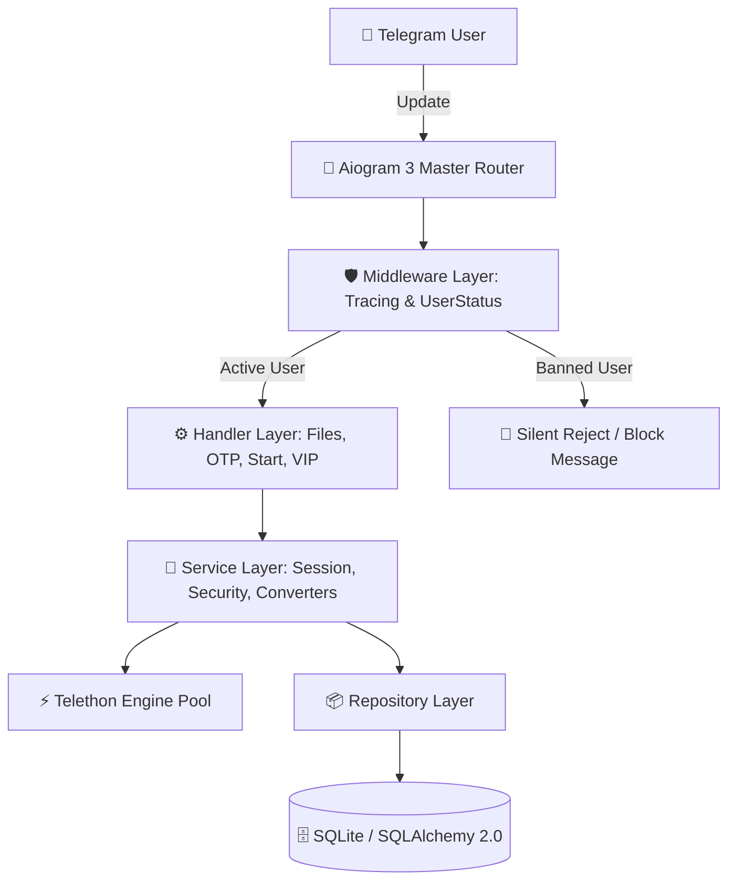
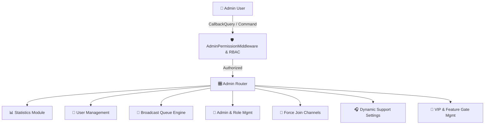
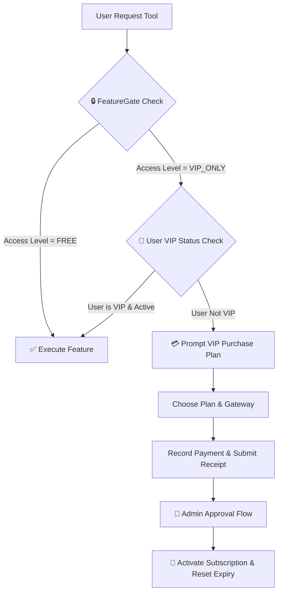
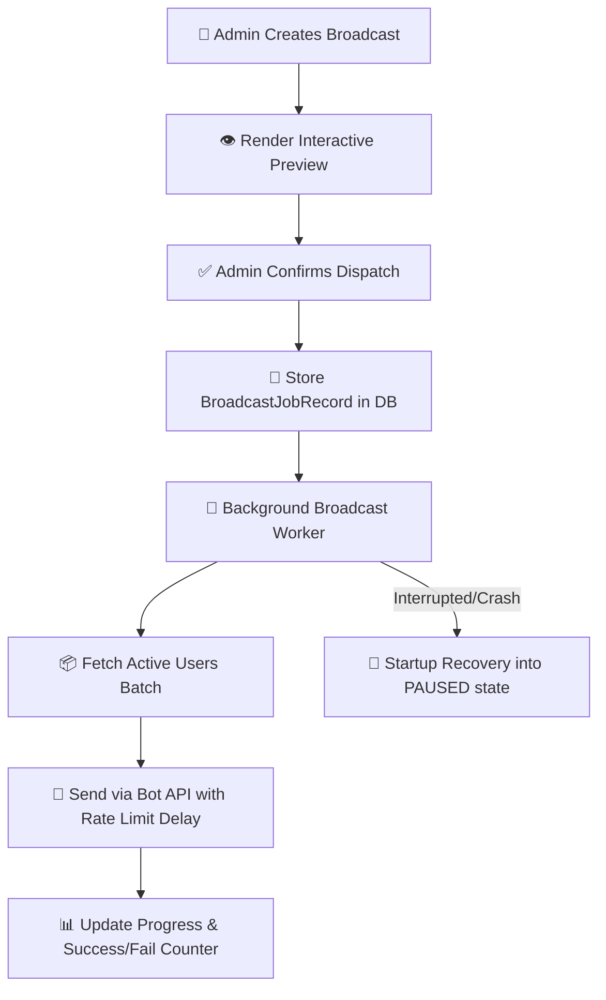
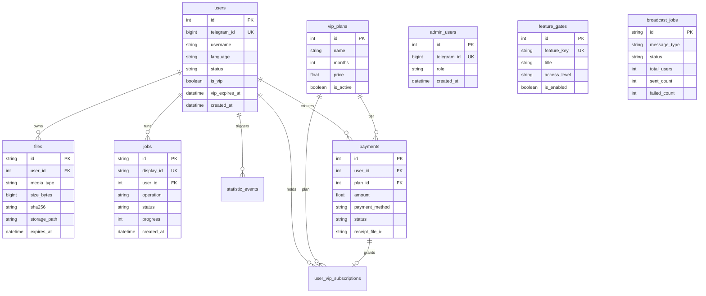

# 🚀 FastTGConvert — Production Telegram Session & File Conversion Suite

[](https://www.python.org/)
[](https://docs.aiogram.dev/)
[](https://www.sqlalchemy.org/)
[](LICENSE)
[](tests/)

FastTGConvert is an enterprise-grade, asynchronous Telegram Bot engine designed for session management, file format conversion, security auditing, and account lifecycle utility execution. Built on Aiogram 3.x, Telethon, and SQLAlchemy 2.0, it features a complete inline-keyboard-driven Admin Panel with Role-Based Access Control (RBAC), multi-channel Force Join enforcement, dynamic VIP subscription management, automated file retention cleanup, and production observability via Prometheus metrics and structured JSON tracing.

---

## 🌐 Documentation Languages

Select your preferred language to read the complete technical documentation:

- 🇬🇧 **[English Documentation](docs/README_EN.md)**
- 🇧🇩 **[বাংলা নথি (Bengali)](docs/README_BN.md)**
- 🇮🇳 **[हिन्दी दस्तावेज़ (Hindi)](docs/README_HI.md)**
- 🇵🇰 **[اردو دستاویزات (Urdu)](docs/README_UR.md)**
- 🇸🇦 **[الوثائق بالعربية (Arabic)](docs/README_AR.md)**
- 🇨🇳 **[中文文档 (Chinese)](docs/README_ZH.md)**

---

## 📌 Executive Summary

### Main Features
- **Session & File Conversions**: Convert bidirectionally between `.session` (Telethon/Pyrogram) and `TData` (Telegram Desktop format), as well as `.json` exports and `.txt` account dumps.
- **Account Utilities**: Account Age Estimation, Session Health Checking, SpamBot Restriction Check, Chat Cleaner, 2FA Password Change/Disable/Reset, Contact List Cleaner, Mass Messaging.
- **Dynamic Feature Access Control (Feature Gates)**: Granular control over every bot capability (FREE vs VIP_ONLY) via database-driven toggles.
- **Role-Based Admin Panel**: Inline-keyboard UI for Owner, Super Admin, Admin, and Support roles. Includes User Search, Direct Messaging, VIP Granting, User Banning, Dynamic Plan Builder, Payment Gateways (TRC20, BEP20, Binance Pay), and Mass Broadcast Engine with queue recovery.
- **Security & Privacy Protection**: Fernet Base64 proxy encryption, UserStatusMiddleware ban enforcement, Telethon session isolation, sensitive data masking in logs, and automated ephemeral file retention purging.
- **Production Observability**: Built-in HTTP server for `/healthz`, `/readyz`, and `/metrics` (Prometheus exporter), structured JSON logging with request Trace IDs, and Grafana dashboard configurations.

---

## 🏛️ System Architecture

### High-Level Architecture



### Admin Panel Architecture



### VIP & Access Control Architecture



### Broadcast Engine Architecture



---

## 🗄️ Database Entity-Relationship Diagram



---

## 🚀 Quick Deployment Guide

```bash
# 1. Clone the repository
git clone https://github.com/mrVXBoT/FastTGConvert_bot.git
cd FastTGConvert_bot

# 2. Create virtual environment
python3 -m venv .venv
source .venv/bin/activate

# 3. Install dependencies
pip install -r requirements.txt

# 4. Copy environment configuration
cp .env.example .env

# 5. Edit .env with your credentials (BOT_TOKEN, ADMIN_ID, API_CREDENTIALS)
nano .env

# 6. Run database migrations & seed defaults
python3 -m app.db.migration

# 7. Start the application
python3 -m app
```

For complete deployment details, systemd configuration, Prometheus alerting, and full multi-language documentation, visit **[docs/README_EN.md](docs/README_EN.md)**.

---

## 🧪 Testing & Code Quality

FastTGConvert enforces rigorous test coverage and static analysis:

```bash
# Run unit & integration test suite (296 tests)
.venv/bin/pytest

# Run static type checker
.venv/bin/mypy app

# Run linter & formatter
.venv/bin/ruff check
```

---

## 📜 License & Compliance

Distributed under the MIT License. See `LICENSE` for more information.
