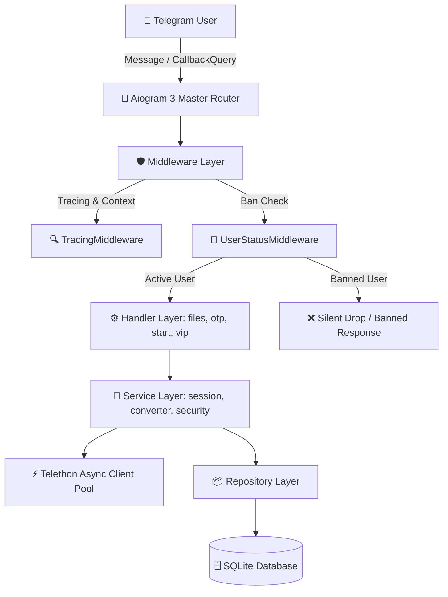
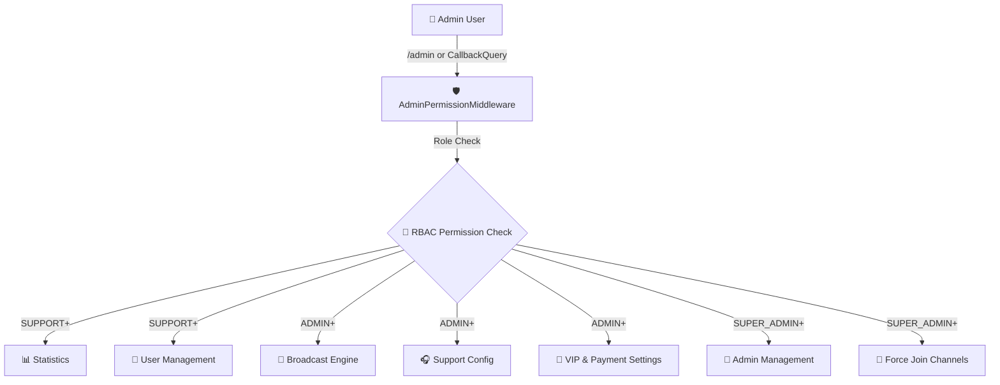
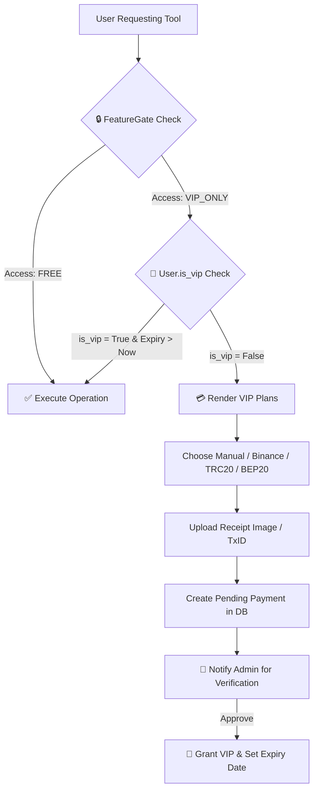
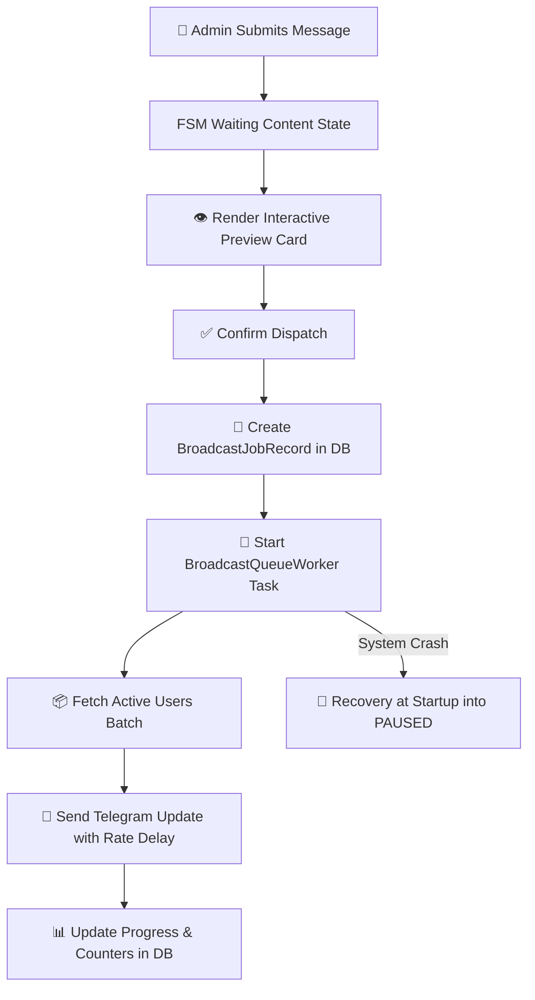
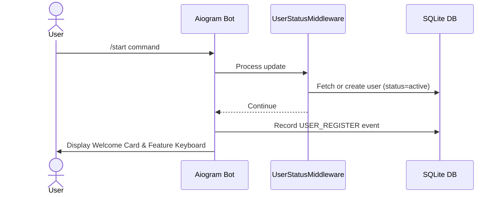
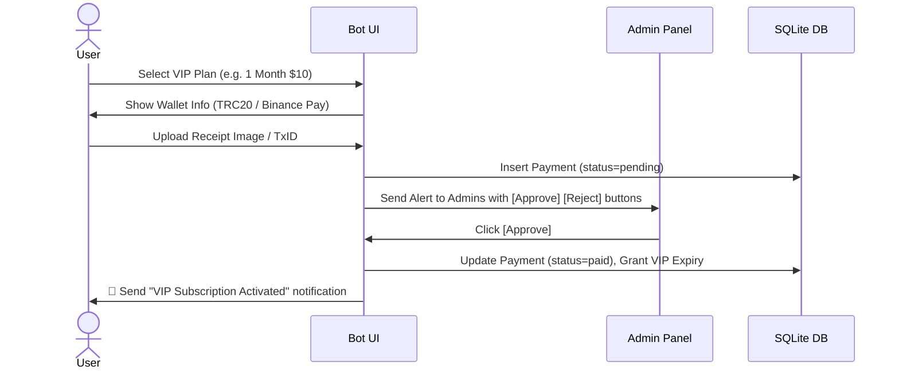

# 📘 FastTGConvert — Full Technical & Production Documentation (English)

Welcome to the comprehensive technical documentation for **FastTGConvert**, a high-performance, asynchronous Telegram Bot and Session Utility platform built for production scale.

---

## 📋 Table of Contents

1. [Project Overview](#1-project-overview)
2. [Architecture Documentation](#2-architecture-documentation)
3. [Complete Feature Documentation](#3-complete-feature-documentation)
   - [User System](#user-system)
   - [Admin Panel & Modules](#admin-panel--modules)
   - [VIP System](#vip-system)
4. [Database Documentation](#4-database-documentation)
5. [Security Documentation](#5-security-documentation)
6. [Deployment Guide](#6-deployment-guide)
7. [Observability & Monitoring](#7-observability--monitoring)
8. [Developer Guide](#8-developer-guide)
9. [Testing Documentation](#9-testing-documentation)
10. [User Flows](#10-user-flows)
11. [Changelog](#11-changelog)

---

## 1. Project Overview

### What is FastTGConvert?
FastTGConvert is a specialized, production-ready Telegram session processing, account auditing, and format conversion system. It empowers Telegram power users, system administrators, and security researchers to inspect, convert, and manage Telegram session files securely.

### Main Features
- **Session & File Format Conversions**: Bidirectional `.session` ↔ `TData` (Telegram Desktop zip/tar), `.session` → `.json`, `.session` → `.txt`.
- **Session Health & Security Auditing**: Account Age Checker, SpamBot Status Verification, Contact List Checker, 2FA Password Management (Change, Disable, Reset), Privacy Settings Inspector/Preset Applicator.
- **Account Maintenance Utilities**: Bulk Session Cleaner (clean chats/dialogs), Mass Messaging, Channel Join/Leave Manager, Active Session Termination (Kill Sessions), Contact Exporter/Deleter.
- **OTP & Messaging Tools**: Instant OTP Code Reader for login authorization codes.
- **Dynamic Feature Access Control (Feature Gates)**: Real-time toggling of any bot tool between `FREE` and `VIP_ONLY`.
- **Inline Keyboard Admin Suite**: Card-based interface for user search, direct messaging, user banning, financial statistics, broadcast queues, role-based admin management, and force-join channels.

### Target Users
- Telegram Community Managers and Administrators.
- Digital Marketers and Automation Engineers managing multi-account setups.
- Security Researchers conducting session audits and privacy hardening.

### Architecture Philosophy
FastTGConvert follows clean architecture principles:
- **Strict Layer Separation**: Transport (Aiogram handlers) → Service Layer (business logic) → Repository Layer (data persistence).
- **Asynchronous First**: Non-blocking I/O with asyncio and Telethon thread pools.
- **Fail-Safe Recovery**: Interrupted batch jobs and mass broadcasts resume gracefully upon restart.
- **Observability Native**: Structured JSON logging with trace IDs and Prometheus metrics endpoints.

---

## 2. Architecture Documentation

### High Level Architecture


### Admin Panel Architecture


### VIP Architecture


### Broadcast Architecture


---

## 3. Complete Feature Documentation

### User System
- **Registration**: Automatic user onboarding upon `/start` or initial interact. Persists `telegram_id`, `username`, `language`, and timestamp.
- **Language Selection**: 6 supported languages (`en`, `fa`, `ru`, `ar`, `zh`, `uz`). Persistent choice saved to `users.language`.
- **User States**: `active`, `banned`.
- **VIP Status**: Tracked via `is_vip` boolean and `vip_expires_at` timestamp. Auto-validated during tool invocation.
- **Ban System**: Banned users are intercepted by `UserStatusMiddleware` at the top of the update pipeline, preventing execution of any command, button, or file handler.

### Admin Panel

#### 📊 Statistics
- Real-time aggregation filtered by **Today**, **This Week**, or **This Month**.
- Displays: Active Users, New Registrations, VIP Subscribers, Total Revenue ($ USD), Total Executed Tasks, Successful Tasks, Failed Tasks.

#### 👥 Users Management
- **Card-Based UI**: Displays Username, Telegram ID, Language, VIP Status, Account Status.
- **Pagination**: 5 users per page with `⬅️ Previous`, `Page X/Y`, `Next ➡️` navigation buttons.
- **Search**: Search users by numeric Telegram ID or `@username`.
- **User Detail View**: Full profile, join date, last active timestamp, task execution breakdown.
- **Actions**: `💎 Give VIP` (1 month default), `❌ Remove VIP`, `🚫 Ban/Unban` toggle, `📩 Send Direct Message` (FSM state prompt).

#### 📢 Broadcast System
- Supports **Custom Broadcasts** (text, photo, video, GIF, document) and **Forward Broadcasts** (forwarded from channels/groups).
- Interactive Preview with `🚀 Confirm & Send` and `❌ Cancel` buttons.
- Features automatic rate-limiting delay between sends, pause/resume capability, and crash recovery.

#### 👮 Admin Management
- Card list of active admins with role indicators.
- **Roles**:
  - `OWNER` (Level 100): Full unrestricted access.
  - `SUPER_ADMIN` (Level 30): Access to Admin Mgmt, Force Join, and all lower features.
  - `ADMIN` (Level 20): Access to Broadcast, VIP, Support, Statistics, User Mgmt.
  - `SUPPORT` (Level 10): Access to Statistics, User View, Direct Messaging.
- **Actions**: Add Admin (FSM role selector + Telegram ID prompt), Change Admin Role, Remove Admin (inline confirmation keyboard).

#### 📌 Force Join
- Dynamic multi-channel mandatory membership enforcement.
- Supports **Public Channels** (`@channel`) and **Private Channels** (invite links).
- Toggle channel active/inactive state, add new channels, remove existing channels.

#### 🎧 Support
- Dynamic support contact username setting saved in `system_settings` table.

#### 💎 VIP System Management
- **Admin**: Create new pricing plans (Name, Months, Price, Currency), edit/disable plans, manage Payment Gateways (Binance Pay ID, TRC20 address, BEP20 address, Manual toggle, Auto switch), approve/reject user payments.
- **User**: Interactive purchase flow, plan selection, payment method selection, receipt attachment upload.

---

## 4. Database Documentation

FastTGConvert uses SQLAlchemy 2.0 with SQLite (`data/bot.db`).

### Tables Overview

| Table Name | Purpose | Key Columns |
|---|---|---|
| `users` | Primary user registry & profile data | `id`, `telegram_id`, `username`, `language`, `status`, `is_vip`, `vip_expires_at` |
| `files` | Ephemeral file metadata tracking | `id` (UUID), `user_id`, `original_name`, `media_type`, `size_bytes`, `sha256`, `storage_path`, `expires_at` |
| `jobs` | Async operation task execution log | `id` (UUID), `display_id`, `user_id`, `operation`, `status`, `progress`, `options_json`, `error_code` |
| `admin_users` | Admin privilege registry | `id`, `telegram_id`, `role` (`OWNER`, `SUPER_ADMIN`, `ADMIN`, `SUPPORT`) |
| `statistic_events` | Granular telemetry events | `id`, `user_id`, `event_type`, `metadata_json`, `created_at` |
| `force_join_channels` | Mandatory channel join settings | `id`, `channel_id`, `title`, `username`, `invite_link`, `channel_type`, `is_active` |
| `feature_gates` | Dynamic feature access control | `id`, `feature_key` (e.g. `session_check`), `title`, `access_level` (`FREE`/`VIP_ONLY`), `is_enabled` |
| `vip_plans` | VIP subscription tier definitions | `id`, `name`, `months`, `price`, `currency`, `is_active` |
| `payment_settings` | Gateway wallet & payout settings | `id`, `manual_enabled`, `binance_id`, `trc20_address`, `bep20_address`, `auto_enabled` |
| `payments` | Financial transaction logs | `id`, `user_id`, `plan_id`, `amount`, `payment_method`, `status`, `receipt_file_id` |
| `user_vip_subscriptions` | Subscription history ledger | `id`, `user_id`, `plan_id`, `payment_id`, `started_at`, `expires_at`, `status` |
| `broadcast_jobs` | Mass broadcast queue records | `id`, `message_type`, `status`, `total_users`, `sent_count`, `failed_count`, `current_index` |
| `system_settings` | Dynamic key-value app settings | `key` (PK), `value`, `updated_at` |

---

## 5. Security Documentation

- **RBAC Enforcement**: `AdminPermissionMiddleware` intercepts all admin endpoints and checks user role against required level (`app/admin/rbac.py`).
- **Proxy Password Encryption**: User proxy credentials are encrypted using Fernet (AES-128-CBC) with `PROXY_ENCRYPTION_KEY`. Plaintext credentials are never logged or stored.
- **Session Isolation**: Telethon instances use temporary isolated memory/file session storages, cleaned up immediately after task completion.
- **Environment Confidentiality**: Sensitive tokens (`BOT_TOKEN`, `API_CREDENTIALS`, `PROXY_ENCRYPTION_KEY`) are parsed safely via Pydantic BaseSettings from `.env`.
- **Sensitive Data Masking**: Log sanitizers automatically mask phone numbers, session strings, and passwords in JSON log outputs.
- **User Ban Protection**: `UserStatusMiddleware` short-circuits update processing for banned users before reaching any handler.

---

## 6. Deployment Guide

### System Requirements
- OS: Linux (Ubuntu 20.04+ / Debian 11+ recommended)
- Python: 3.11 or higher
- RAM: Minimum 1 GB (2 GB recommended for heavy parallel conversions)

### Environment Setup (`.env`)

```env
# BOT CREDENTIALS
BOT_TOKEN=123456789:ABCdefGHIjklMNOpqrsTUVwxyz
ADMIN_ID=7865612517
API_CREDENTIALS=123456:abcdef0123456789abcdef0123456789

# DATABASE & STORAGE
DATABASE_URL=sqlite:///data/bot.db
STORAGE_DIR=data/storage
MAX_UPLOAD_MB=20
RETENTION_MINUTES=60

# SECURITY
PROXY_ENCRYPTION_KEY=g4T7-k9X_zA1bC2dE3fG4hI5jK6lM7nO8pQ9rS0tU1V=

# METRICS & OBSERVABILITY
METRICS_ENABLED=true
METRICS_HOST=127.0.0.1
METRICS_PORT=8080
METRICS_AUTH_TOKEN=secure_bearer_token_here
```

### Production Linux Service (`systemd`)

Create file `/etc/systemd/system/fasttgconvert.service`:

```ini
[Unit]
Description=FastTGConvert Telegram Bot Service
After=network.target

[Service]
Type=simple
User=ubunti
WorkingDirectory=/home/ubunti/Desktop/my-projects/@FastTGConvert_bot/FastTGConvert_bot
ExecStart=/home/ubunti/Desktop/my-projects/@FastTGConvert_bot/FastTGConvert_bot/.venv/bin/python3 -m app
Restart=always
RestartSec=5
Environment=PYTHONUNBUFFERED=1

[Install]
WantedBy=multi-user.target
```

Enable and start:
```bash
sudo systemctl daemon-reload
sudo systemctl enable fasttgconvert
sudo systemctl start fasttgconvert
```

---

## 7. Observability & Monitoring

### Metrics HTTP Server
FastTGConvert includes a standalone asyncio HTTP server (`app/core/metrics_server.py`) running on `METRICS_PORT` (default: 8080).

- **`/healthz`**: Liveness probe (returns `{"status": "ok"}`).
- **`/readyz`**: Readiness probe verifying SQLite database connectivity.
- **`/metrics`**: Prometheus format metrics endpoint (supports Bearer token authorization).

### Key Metrics Exported
- `bot_updates_total`: Total Telegram updates processed.
- `bot_tasks_total`: Total task executions counter by operation and status.
- `bot_task_duration_seconds`: Histogram of task execution latency.
- `bot_users_total`: Active user gauge breakdown.

---

## 8. Developer Guide

### Project Structure Overview

```
app/
 ├── admin/               # Admin Panel UI, Callbacks, Handlers, RBAC
 │    ├── handlers/       # Module handlers (stats, users, broadcast, admins, etc.)
 │    ├── callbacks.py    # Aiogram CallbackData models
 │    ├── keyboards.py    # Dynamic Inline Keyboard builders
 │    ├── middlewares.py  # Admin RBAC Middleware
 │    └── rbac.py         # Role hierarchy & permission definitions
 ├── core/                # Logging, Tracing, Retry, Metrics server
 ├── db/                  # Database models, Session factory, Migrations, Repositories
 ├── handlers/            # Main user handlers (files, otp, start, vip)
 ├── middlewares/         # Global middlewares (UserStatusMiddleware, TracingMiddleware)
 ├── services/            # Pure business logic services (telethon, session converters, security)
 └── config.py            # Pydantic Settings configuration
```

---

## 9. Testing Documentation

FastTGConvert features a comprehensive test suite powered by `pytest`.

- **Current Test Count**: **296 passed**
- **Type Checker**: `mypy app` (0 errors)
- **Linter**: `ruff check` (0 errors)

### Execute Tests
```bash
# Run all 296 unit and integration tests
.venv/bin/pytest

# Run tests with verbose output
.venv/bin/pytest -v
```

---

## 10. User Flows

### New User Onboarding Flow


### VIP Purchase Flow


---

## 11. Changelog

### Version 5.x — Dynamic Admin Panel & RBAC Overhaul
- **Inline Keyboard Admin Panel**: Complete migration from command-based flows (`/add_admin`, `/remove_admin`) to card-based Inline Keyboards.
- **Granular RBAC**: Implemented 4-level role hierarchy (`OWNER`, `SUPER_ADMIN`, `ADMIN`, `SUPPORT`) with section-level and action-level permission enforcement.
- **Full Feature Gate Seed**: Added all 27 bot features to `feature_gates` table with dynamic FREE/VIP_ONLY access control.
- **UserStatusMiddleware Security Fix**: Hardened Banned user interception across all updates (messages, callback queries, inline queries).
- **HTML Parsing Safety**: Standardized `html.escape` and `parse_mode="HTML"` across all admin modules to prevent Telegram parsing exceptions.
